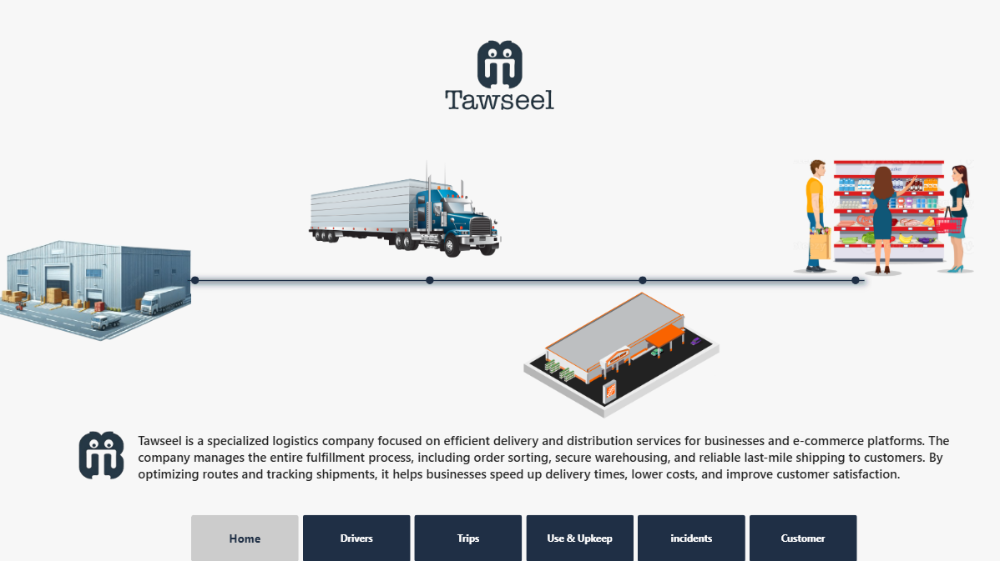
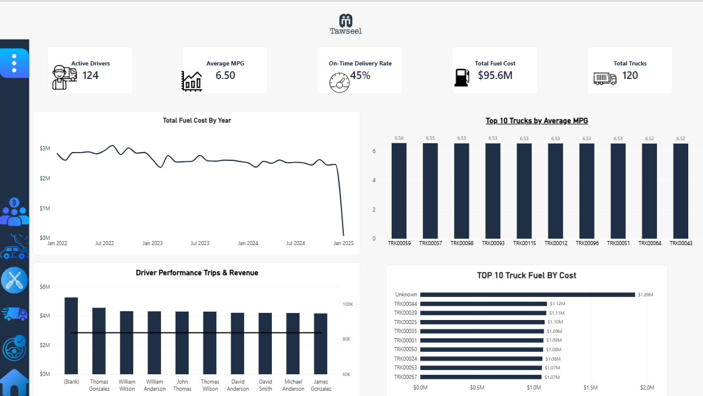
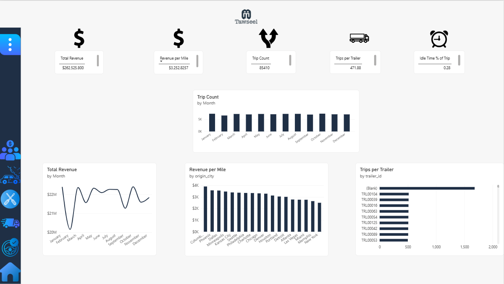
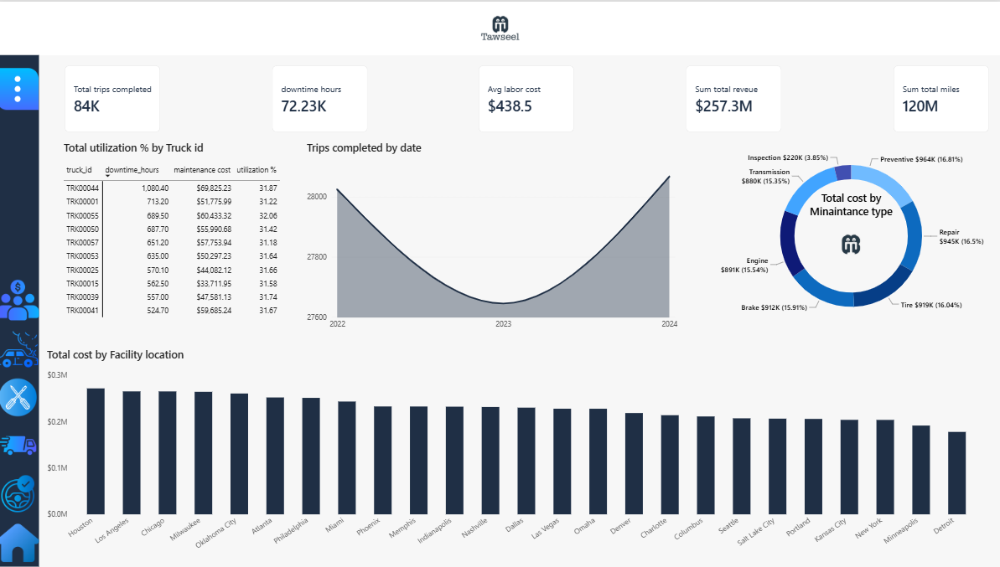
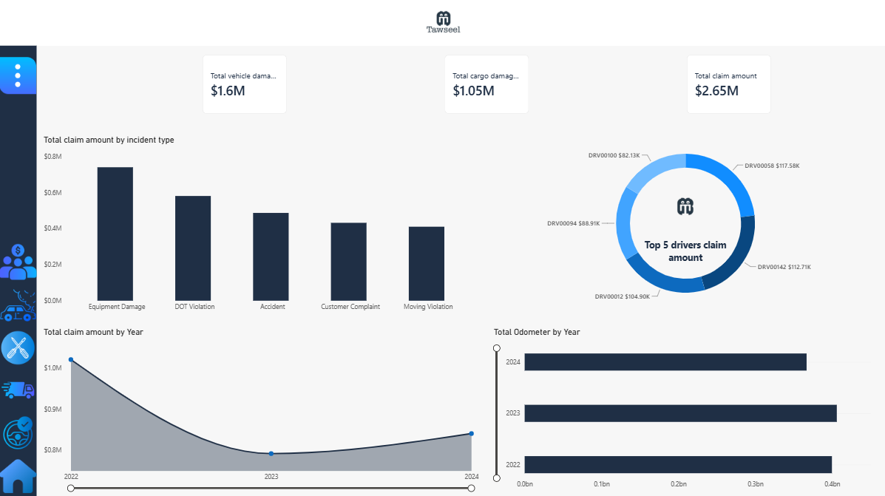
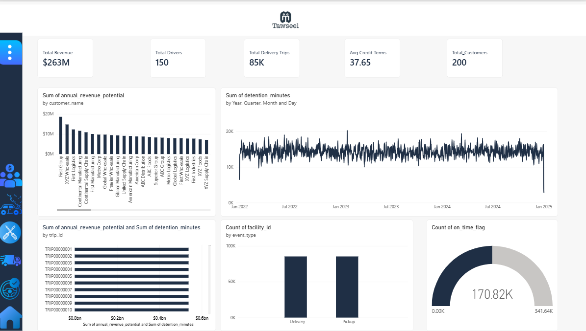

# Logistics Operations Dashboard

A Power BI dashboard for monitoring and analyzing the performance of a logistics / trucking operation — covering trips, drivers, fleet utilization, maintenance, fuel, customers, and safety incidents.

## 📊 Overview

This report (`logistics_operations.pbix`) brings together data from across the logistics operation into a single Power BI data model, with dedicated report pages for different operational areas: fleet usage, driver performance, trip/delivery activity, maintenance & upkeep, customer accounts, and safety incidents.

## 📁 Report Pages

| Page | Description |
|---|---|
| **Home** | Executive summary / landing page with top-level KPIs |
| **Drivers** | Driver performance, active driver counts, and monthly driver metrics |
| **Trips** | Trip volume, delivery performance, and on-time rates |
| **Use & Upkeep** | Fleet/truck utilization and maintenance activity |
| **incidents** | Safety incidents, claims, and damage costs |
| **Customer** | Customer accounts, revenue, and credit terms |

## 🗂️ Data Model

The model is built around the following tables:

- **trips** – individual trip records (trip ID, dispatch date, origin, on-time flag)
- **loads** – load/shipment records (load date, trips completed)
- **delivery_events** – delivery-level event tracking (scheduled datetime, detention minutes)
- **drivers** – driver master data (driver ID, full name)
- **driver_monthly_metrics** – monthly aggregated driver KPIs
- **truck_utilization_metrics** – truck usage and downtime metrics
- **maintenance_records** – vehicle maintenance history (maintenance date/type, cost, downtime)
- **fuel_purchases** – fuel purchase transactions (purchase date, average MPG)
- **trailers** – trailer master data
- **routes** – route definitions
- **facilities** – facility/location master data (type, location)
- **customers** – customer master data (name, annual revenue potential)
- **safety_incidents** – incident records (type, date, at-fault/injury/preventable flags, claim amount)

## 📈 Key Measures

| Category | Measures |
|---|---|
| Revenue & Cost | Total Revenue, Revenue per Mile, Sum total cost, Sum total revenue, Total Fuel Cost, Total maintenance cost |
| Trips & Delivery | Total Trips Completed, Total Delivery Trips, Trip Count, On-Time Delivery Rate, Trips per Trailer |
| Fleet & Utilization | Total Trucks, Total Utilization %, Total Odometer, Sum total miles, Idle Time % of Trip, Average MPG |
| Drivers | Active Drivers, Total Drivers, Avg Labor Cost |
| Maintenance & Downtime | Total Downtime Hours (Maintenance), Total Downtime Hours (Utilization) |
| Safety & Claims | Total Claim Amount, Total Vehicle Damage Cost, Total Cargo Damage Cost |
| Customers | Total Customers, Avg Credit Terms |

## 🛠️ Requirements

- [Power BI Desktop](https://powerbi.microsoft.com/desktop/) (latest version recommended)
- Access to the underlying data sources used to refresh the model (not included in this repo)

## 🚀 Getting Started

1. Clone or download this repository.
2. Open `logistics_operations.pbix` in Power BI Desktop.
3. If prompted, update the data source connections/credentials to point to your own data.
4. Refresh the data model and explore the report pages.

## 📌 Notes

- This repository contains the `.pbix` file only; raw/source data is not included.
- Some measure names in the model contain minor typos (e.g. "Sum total reveue") inherited from the original build — consider cleaning these up before further development.

## 📷 Preview

### Home

### Drivers

### Trips

### Use & Upkeep

### Incident

### Customer

---

## 👤 Author
**Thomas Wagdy** — Data Analyst

- GitHub: [ThomasWagdy](https://github.com/ThomasWagdy)
- LinkedIn: [thomas-wagdy](https://www.linkedin.com/in/thomas-wagdy-2355653b3/)
